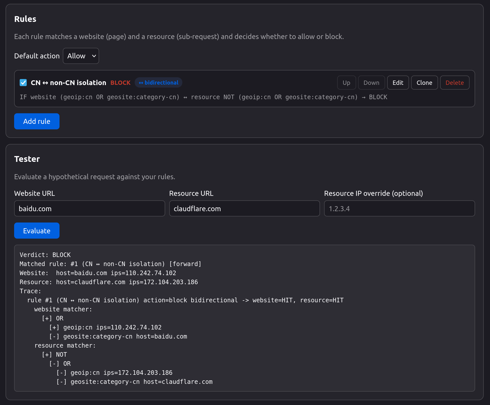

# GeoLock

  

GeoLock is a Firefox extension that blocks or allows requests with per-page rules: geoip country, geosite category, sing-box rule-sets, domain regex, and IP ranges.

## How it works

Every time a page loads something — a script, an image, an API call — GeoLock checks your rules and lets it through or stops it.

A rule pairs a **source** (the page making the request) with a **destination** (what it's loading). If both match, the rule fires with its action (allow or block). Rules run top to bottom, first match wins; if nothing matches, your default action applies.

**Example rules:**
- When on a US site, block resources resolving to non-US IPs
- Allow only known CDNs on a sensitive site
- Block all traffic between two countries with one isolate rule

## Matchers

- **geoip** — country of the resolved IP (v2fly geoip.dat)
- **geosite** — domain category like `google`, `category-ads-all` (v2fly geosite.dat)
- **ruleset** — sing-box rule-set, binary `.srs` or JSON source format
- **domain** — regex against the hostname
- **url** — regex against the full URL
- **ip** — CIDR range, IPv4 or IPv6
- **any** — matches everything
- **and / or / not** — combine the above

## Features

- **Bidirectional rules** — fire in both source↔destination directions
- **Isolate rules** — define one boundary (say, "US") and fire whenever traffic crosses it
- **Data sources by URL** — geoip/geosite databases and any number of named sing-box rule-sets, auto-updated on a schedule
- **Remote configuration** — fetch and apply your config from a URL
- Built-in rule tester, per-page block log with match traces
- Raw JSON editor, import/export, one-click reset
- In-memory DNS cache, no telemetry

## Configuration

Config schema: [`docs/config/v2.md`](docs/config/v2.md). Legacy v1 configs ([`docs/config/v1.md`](docs/config/v1.md)) migrate automatically.

## Firefox-only

GeoLock needs blocking `webRequest`, which Chrome MV3 removed, and geoip/CIDR matching needs the resolved destination IP, which declarativeNetRequest doesn't expose. Requires Firefox 142+.

## Disclaimer

Experimental; treat as a PoC. May contain bugs, architectural flaws, or security issues.

## License

[MIT](LICENSE)
